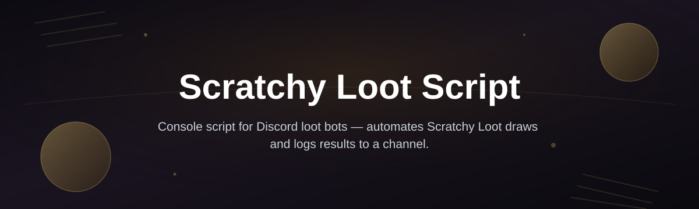
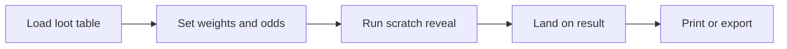

# scratchy-loot-dc-console

| Requirement | Details |
|---|---|
| OS | Windows 10 or 11 (64-bit) |
| Install | Standalone console app, nothing to compile |
| Dependencies | None — download the archive and run the executable |
| Disk space | Under 50 MB |

*A scratch-off style loot reveal console for tabletop groups and Discord game masters who want a fast, fair drop instead of another spreadsheet.*

## What this is

**TL;DR:** Scratchy Loot Script is a small Windows console app that turns loot rolls into a "scratch card" reveal — you set the odds, it does the reveal, everyone at the table sees the same fair result.

This project started as a weekend build for a home D&D group that got tired of arguing over loot tables mid-session. Scratchy Loot Script runs as a lightweight console program on Windows: you feed it a loot pool with weighted rarities, it "scratches" through the entries with a short animated reveal, and it prints the winning item to the console (and, if you're running it alongside a Discord session, to share directly in chat). No web dashboard, no account, no server — just a console window and a loot table.

The name describes exactly what it does: it's a scratch-card mechanic applied to loot generation, built for people running games, not people building software. If you've ever wanted the tactile "will it be common or legendary" tension of a real scratch ticket, but for your campaign's treasure hoard, that's the itch this scratches.

  

The button above opens the project's landing page, where the current Windows build of Scratchy Loot Script is available to download.

## Who it is for

**TL;DR:** built for game masters, Discord communities, and anyone who runs recurring loot drops and wants them to feel fair and fun.

- **Tabletop game masters** running D&D, Pathfinder, or homebrew systems who need quick, weighted loot rolls at the table.
- **Discord server owners** running loot-drop events, giveaways, or RPG bots who want a console-side reveal tool to pair with their community.
- **Streamers and content creators** who want a visual, suspenseful loot reveal moment on screen during a session.
- **Solo devs and hobbyists** curious about a compact console app with a scratch-card animation loop they can study or extend.
- **New contributors** looking for a small, friendly Windows console codebase to make a first pull request against.

## What you can do

**TL;DR:** define a loot pool, set the odds, run the reveal — here's what's actually in the box.

- **Build weighted loot tables** — assign rarity weights per item so commons stay common and legendaries stay rare.
- **Run a scratch-style reveal animation** directly in the Windows console, no browser required.
- **Save and reload loot pool presets** so you don't retype your dungeon's treasure list every session.
- **Batch-roll multiple scratches** in one run for parties or multi-player drops.
- **Export results to a plain text log** you can paste into Discord or your session notes.
- **Adjust reveal speed and console color themes** for streaming or low-light table setups.
- **Seed rolls for reproducible tests** when you're tuning drop rates before a real session.
- **Run fully offline** — no network calls, no telemetry, no accounts.

## Getting started

**TL;DR:** visit the landing page, grab the Windows build, run the console app — you're rolling loot in under two minutes.

1. Open the landing page using the download button above.
2. Download the current Windows release archive from that page.
3. Extract it anywhere on your machine — a folder on your desktop works fine.
4. Double-click `scratchy-loot-dc-console.exe` to launch the console.
5. Load one of the included sample loot tables, or point it at your own, and start scratching.

## Requirements

**TL;DR:** if you've got Windows 10 or 11, you're covered — nothing else to install.

- Windows 10 or Windows 11, 64-bit.
- No .NET SDK, Python, or Node installation required — the executable is standalone.
- No admin rights needed to run it from a regular user folder.
- A loot table file (a sample set ships with the download so you can try it immediately).

## How it works

**TL;DR:** load a table, weight the odds, scratch through entries, land on a result, print or share it.

1. **Load a loot table** — a plain list of items with rarity weights you define.
2. **Set the reveal parameters** — how many scratches, how fast, how many players.
3. **Run the scratch sequence** — the console cycles through entries with a short animated reveal.
4. **Land on a weighted result** — the outcome respects the odds you set, not a flat random pick.
5. **Output the result** — printed to console and optionally logged to a text file for sharing.

## FAQ

**TL;DR:** the questions people actually ask before downloading, answered plainly.

**Is Scratchy Loot Script an actual scratch card, or just a random number generator with animation?**
It's a weighted random result with a scratch-card-style console animation layered on top — the odds are real, the reveal is just presented as a scratch rather than an instant number.

**Does it need Discord installed to work?**
No. It runs as a standalone Windows console app. You can copy its output into Discord manually, or run it side-by-side during a voice session.

**Can I use my own loot tables instead of the sample ones?**
Yes — loot tables are plain text/JSON files you edit yourself, and the app loads whichever file you point it at.

**Will it work on Windows 7 or on macOS/Linux?**
It targets Windows 10 and 11 specifically. Other operating systems aren't officially supported right now.

**Is this affiliated with any specific tabletop system or publisher?**
No — it's an independent weekend project, not tied